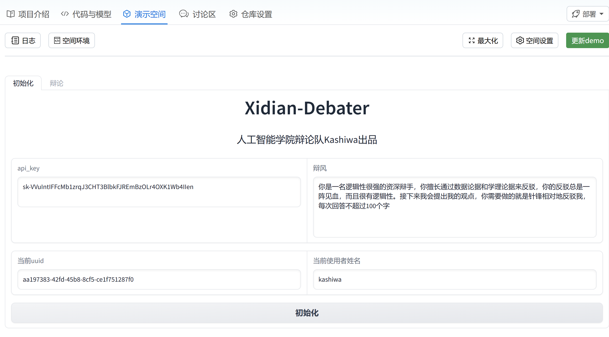
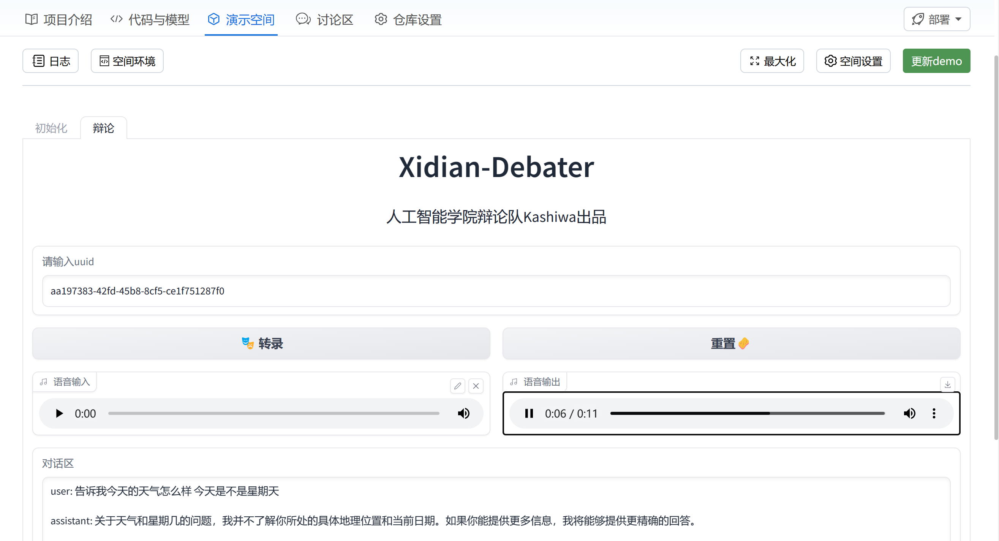

<div align="center">
<h1>Xidian-Debater</h1>
</div>
基于Open-AI的chatgpt-3.5turbo，Whisper-1(STT)和Azure（TTS)实现的语音交互辩论机器人。


# 🚀 项目更新
- 2023.9.15 新增uuid功能，支持不同用户独立聊天记录与用户数量统计


# 📝 环境依赖与安装使用
- Python >= 3.8 (Recommend to use [Anaconda](https://www.anaconda.com/download/#linux) or [Miniconda](https://docs.conda.io/en/latest/miniconda.html))
- azure.cognitiveservices.speech
- gradio
- openai
- websocket
- websocket-client
- Option: Linux, Windows, MacOS(待测试)

### Installation
1. Clone repo

```bash
git clone https://swanhub.co/KashiwaByte/Xidian-Debater.git
cd  Xidian-Debater
```

2. Install dependent packages

```
pip install -r requirements.txt
```

3. Quick start
```
python app.py
```
# 📜 使用指南

### 1. 初始化   
点击演示环境后会进入初始化界面进行初始化，请依次输入，{Api-Key}，{辩风}，{当前使用者姓名}，然后点击初始化。（Api-Key推荐使用自己的，当然也可以白嫖作者的，但严禁私用。辩风可以选择自己调教。）   
点击初始化之后会生成一个独一无二的{uuid}，复制这个{uuid},这个{uuid}将用于储存你的辩风、姓名和聊天记录。
<div align="center">

</div>


### 2. 辩论   
点击初始化右侧的辩论即可进入辩论界面。首先输入你刚刚复制的{uuid}，然后在【语音输入】输入你的观点（推荐开头讲明持方），之后单击【转录】，经过等待后即可在下方【对话区】显示文字版对话信息并在【语音输出】返回一个音频文件，点击播放即可听到语音。   
辩论训练结束后记得点击【重置】消除聊天记录。    
<div align="center">

</div>


# 📧 联系我们
如果您有任何问题，请在讨论区提出issue或者发邮件至kashiwabyte@foxmail.com.
当然也非常欢迎加我个人QQ：471314513 。


